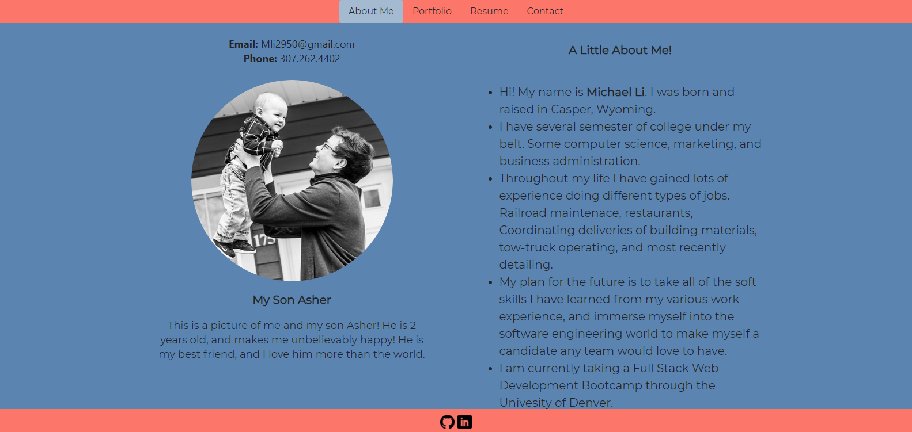
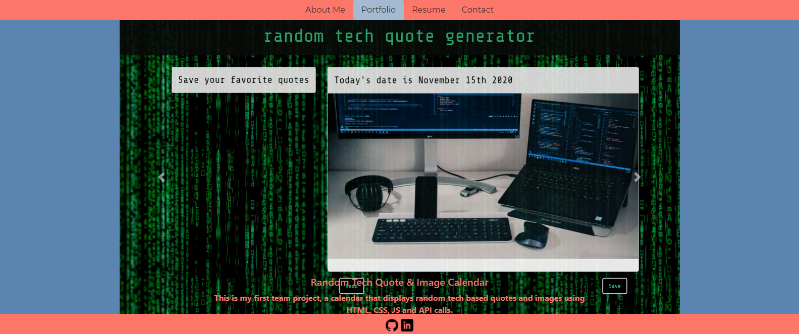
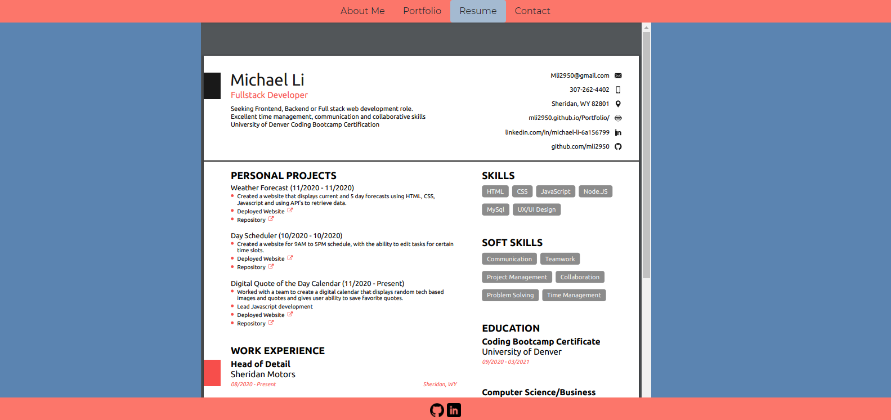

## Homework 7

The task of this homework was to get my portfolio, github, and linkedin ready for employers to view.

## Coding

I used the template of my Week 2 homework, the portfolio website. I changed the styling of some elements, added a carousel to display my projects, and introduced my resume and contact info to the page.

## Links

[Live Webpage](https://mli2950.github.io/Portfolio/)  
[My Repository](https://github.com/mli2950/Portfolio)

## Screenshots of live websites

