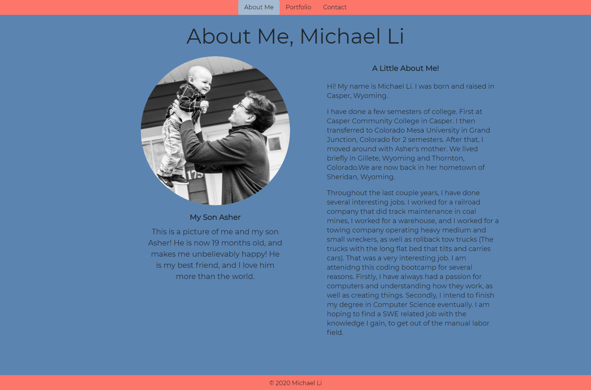
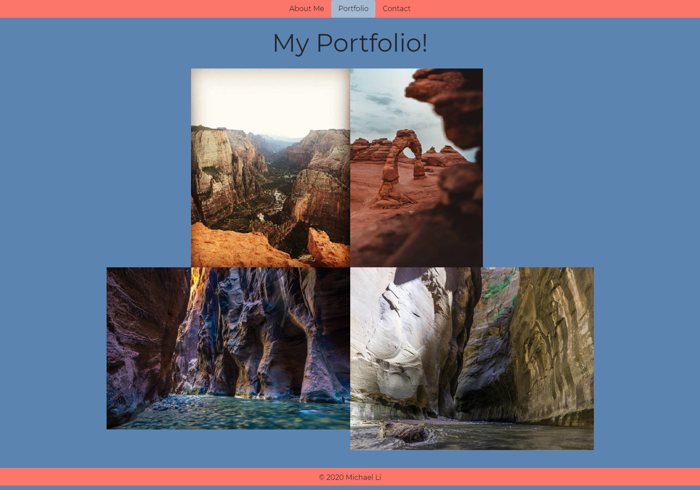

## Homework 2

This homework was to create a website, with an "About me" homepage, a portfolio, and contact form that is responsive to different platforms.

## Coding

Setting up the HTML for this project was fairly simple. The hardest parts were getting things positioned correctly using the grid layout, and changing my bootstrap elements to the styling that I wanted with CSS properties.

## Links

[Live Webpage](https://mli2950.github.io/Homework2/)  
[My Repository](https://github.com/mli2950/Homework2)

## Screenshots of live websites

